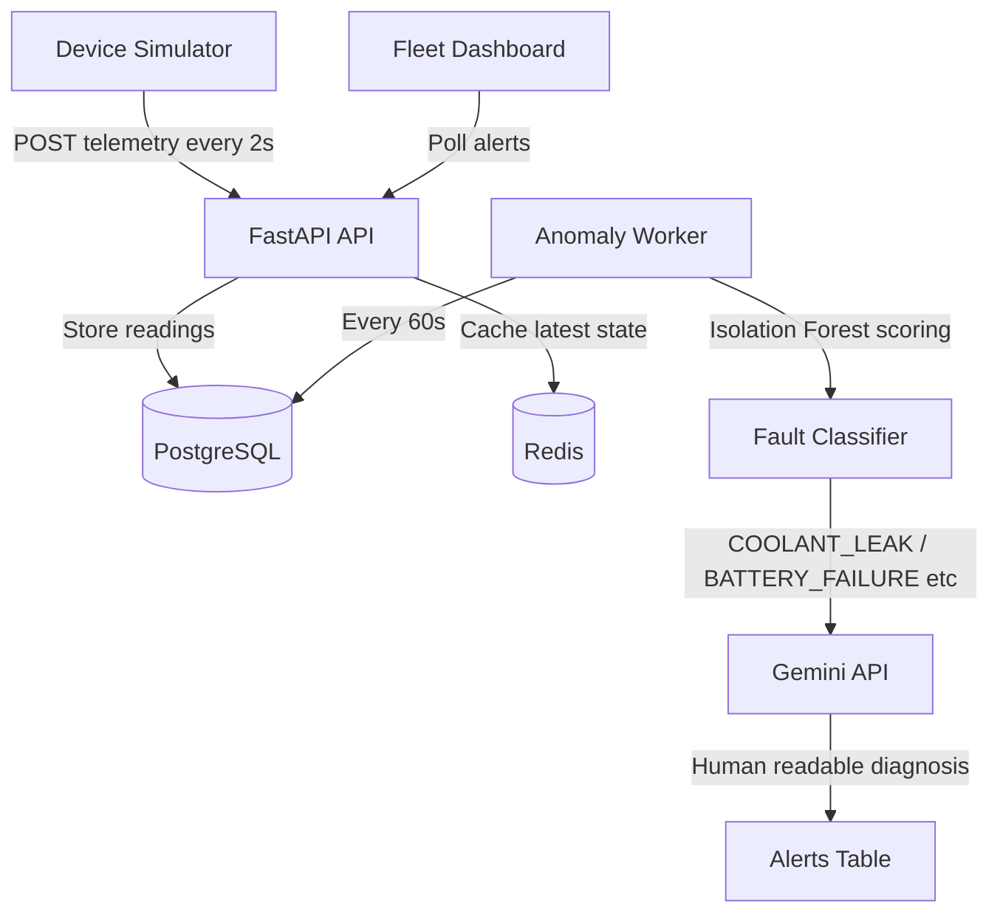

# VehicleWatch — Real-Time Fleet Telemetry & Predictive Maintenance API

## Overview

Fleet operators lose thousands of dollars per breakdown — not from the repair itself, but from unplanned downtime, missed deliveries, and emergency roadside assistance. VehicleWatch solves this by continuously ingesting sensor telemetry from every vehicle in the fleet, running an unsupervised machine learning ensemble (Isolation Forest + Local Outlier Factor) to detect abnormal patterns before they become failures, and generating human-readable diagnostic summaries via Google Gemini that tell operators exactly which component is failing, why, and what to do about it. Early fault detection — catching a coolant leak at engine_temp 112°C rather than at 160°C engine seizure — turns a £200 hose replacement into something that never becomes a £12,000 engine rebuild.

---

## Architecture



**Data flow in plain English:**
1. The simulator (or real devices) POST telemetry every 2 seconds. FastAPI validates, stores to PostgreSQL, and caches the latest reading per device in Redis.
2. Every 60 seconds the background anomaly worker fetches all unscored telemetry, trains or loads a cached Isolation Forest + LOF ensemble per device, and scores each reading.
3. Anomalous readings (score < −0.1) are run through the rule-based fault classifier to get a named fault type (COOLANT_LEAK, BATTERY_FAILURE, etc.) and confidence level.
4. The classified fault, anomaly score, and top z-score contributors are passed to Gemini, which returns a 3-sentence diagnostic in plain English.
5. Alerts are stored to PostgreSQL and immediately visible in the dashboard.

---

## Tech Stack

| Technology | Version | Why We Chose It |
|---|---|---|
| **FastAPI** | 0.115+ | Native async, automatic OpenAPI docs, Pydantic v2 validation — all essential for high-throughput telemetry ingestion without blocking on I/O |
| **PostgreSQL** | 15 | JSONB support for storing variable-length `affected_metrics` with GIN indexing, `timestamptz` for all timestamps, and robust support for future monthly telemetry partitioning |
| **Redis** | 7 | Two pools: text-decoded pool for rate-limiting sorted sets and device state cache; binary pool (decode_responses=False) for pickling sklearn model bundles without corruption |
| **Isolation Forest** | scikit-learn 1.4+ | Unsupervised anomaly detection that needs no labelled fault data — critical since fleet faults are rare and unlabelled. O(n log n), handles 10-dimensional feature space efficiently |
| **Local Outlier Factor** | scikit-learn 1.4+ | Density-based confirmation layer. When LOF also flags a reading, ensemble confidence is upgraded to HIGH — reducing false positives without sacrificing recall |
| **Google Gemini** | gemini-1.5-flash | Fast, low-cost, strong at structured maintenance advice. Prompt includes fault type, sensor values, z-score deviations, and grounded playbooks — resulting in actionable per-fault diagnostics |
| **Docker / Compose** | 24+ | Three-service stack (api + postgres + redis) with health checks and restart policies for reproducible local development and production parity |
| **Railway** | — | Zero-config deployment from Dockerfile with `alembic upgrade head` in the start command, `$PORT` injection, and `/health` deep-check endpoint for liveness monitoring |

---

## The 5 Fleet Vehicles

The simulator runs 5 vehicles concurrently, each with a unique stateful fault pattern. Degradation accumulates across readings — it is not random noise.

| Vehicle | Fault Pattern | Mechanism |
|---|---|---|
| **Truck-Alpha** | Healthy baseline (control) | All sensors stay within normal ranges for the entire run. Provides the ML model with clean training data and acts as the anomaly-free control vehicle |
| **Truck-Beta** | Developing coolant leak | `engine_temp` baseline rises `+4°C` every 20 readings. After 100 readings the base reaches `115°C` consistently. Vibration rises proportionally with thermal stress. Simulates a slow coolant hose leak that worsens with each engine cycle |
| **Truck-Gamma** | Battery / alternator degradation | `battery_voltage` drops `0.05V` every 15 readings, starting at `13.8V`. Below `11.8V` the ECM receives unstable power, causing `±500 RPM` erratic fluctuations. Simulates a dying battery cell or failing alternator diode |
| **Truck-Delta** | Transmission stress / slip | When `speed > 70 km/h`, RPM jumps to `3500–4500` (above the normal `3000` max). Vibration rises during slip events. Simulates a slipping transmission clutch pack that over-revs under load |
| **Truck-Echo** | Brake wear / wheel bearing | Vibration scales with speed: `< 60 km/h` → normal `0.5–3.0g`; `60–90 km/h` → `5–8g`; `> 90 km/h` → `7–10g`. Engine temp and RPM stay normal. Simulates a worn wheel bearing that amplifies under centrifugal load |

---

## Fault Detection Logic

### How Isolation Forest Works

Isolation Forest detects anomalies by randomly partitioning the feature space using decision trees. Normal readings require many partitions to isolate because they cluster together; anomalous readings are isolated in very few splits. The anomaly score is the average path length across all trees — a score closer to `−1.0` means the reading was isolated very quickly, i.e., it is far from the learned normal distribution.

VehicleWatch uses a 10-dimensional feature space — 6 raw sensor readings plus 4 engineered cross-sensor features:

- `temp_per_rpm` — engine heat relative to load (catches overheating at idle)
- `vib_per_speed` — vibration at low speed (isolates internal faults from road vibration)
- `engine_stress` — combined thermal × mechanical load index
- `electrical_load` — battery voltage × speed proxy for alternator demand

Score thresholds: `> −0.1` = normal, `< −0.1` = anomalous, `< −0.3` = MEDIUM alert, `< −0.5` = CRITICAL alert.

### Fault Classification Taxonomy

After an anomalous score is confirmed, a rule-based classifier maps sensor readings to a named fault type. Rules are evaluated in priority order so multi-sensor conjunctions are caught first:

| Fault | Primary Indicator | Confidence HIGH |
|---|---|---|
| `ENGINE_STRESS` | `rpm > 3500` AND `engine_temp > 100°C` simultaneously | Both `rpm > 4000` AND `engine_temp > 110°C` |
| `COOLANT_LEAK` | `engine_temp > 110°C` (no proportional RPM rise) | `engine_temp > 120°C` |
| `TRANSMISSION_STRESS` | `rpm > 3200` AND `speed > 60 km/h` | `rpm > 4000` |
| `BATTERY_FAILURE` | `battery_voltage < 11.8V` | `voltage < 11.5V` |
| `BRAKE_WEAR` | `vibration > 6g` AND `speed > 60 km/h` AND normal temp | `vibration > 8g` |
| `UNKNOWN_ANOMALY` | Fallback — no pattern matches | Always MEDIUM |

---

## API Documentation

All endpoints return JSON. All routes except `/health` and `/api/v1/auth/*` require a Bearer token.

### Register

```bash
curl -X POST http://localhost:8000/api/v1/auth/register \
  -H "Content-Type: application/json" \
  -d '{"email": "admin@fleet.com", "password": "securepass123", "role": "ADMIN"}'
```

```json
{
  "id": "550e8400-e29b-41d4-a716-446655440000",
  "email": "admin@fleet.com",
  "role": "ADMIN",
  "created_at": "2026-04-22T10:00:00Z"
}
```

### Ingest Telemetry

```bash
curl -X POST http://localhost:8000/api/v1/devices/{device_id}/telemetry \
  -H "Authorization: Bearer {token}" \
  -H "Content-Type: application/json" \
  -d '{
    "gps_lat": 37.7749,
    "gps_lon": -122.4194,
    "engine_temp": 118.3,
    "rpm": 2200,
    "fuel_level": 45.2,
    "battery_voltage": 13.1,
    "speed": 65.0,
    "vibration": 1.8
  }'
```

```json
{
  "id": "a1b2c3d4-...",
  "device_id": "...",
  "recorded_at": "2026-04-22T10:01:02Z",
  "engine_temp": 118.3,
  "rpm": 2200.0,
  "fuel_level": 45.2,
  "battery_voltage": 13.1,
  "speed": 65.0,
  "vibration": 1.8
}
```

### Get Alerts

```bash
curl "http://localhost:8000/api/v1/alerts?page_size=10" \
  -H "Authorization: Bearer {token}"
```

```json
{
  "items": [
    {
      "id": "...",
      "device_id": "...",
      "severity": "CRITICAL",
      "anomaly_score": -0.5821,
      "fault_type": "COOLANT_LEAK",
      "fault_confidence": "HIGH",
      "llm_summary": "Truck-Beta is showing signs of COOLANT_LEAK with HIGH confidence...",
      "acknowledged": false,
      "created_at": "2026-04-22T10:02:00Z"
    }
  ],
  "total": 1,
  "page": 1,
  "page_size": 10,
  "pages": 1
}
```

### Fleet Analytics

```bash
curl http://localhost:8000/api/v1/analytics/fleet \
  -H "Authorization: Bearer {token}"
```

```json
{
  "total_devices": 5,
  "active_devices": 5,
  "total_alerts": 12,
  "unacknowledged_alerts": 3,
  "alerts_by_severity": {
    "CRITICAL": 2,
    "MEDIUM": 7,
    "LOW": 3
  },
  "avg_engine_temp": 94.7,
  "avg_fuel_level": 61.3
}
```

---

## Quick Start

### Run with Docker Compose

```bash
git clone https://github.com/yourusername/vehiclewatch
cd vehiclewatch
cp .env.example .env
# Add your GEMINI_API_KEY to .env (optional — fallback summaries work without it)
docker-compose up --build
```

The API will be available at `http://localhost:8000`.  
Swagger UI: `http://localhost:8000/docs`  
Fleet Dashboard: `http://localhost:8000/dashboard`

### Run Database Migrations

```bash
alembic upgrade head
```

### Run the Simulator

```bash
pip install httpx
python simulator/device_simulator.py --host http://localhost:8000 --devices 5
```

The simulator registers 5 vehicles with unique fault personalities and streams telemetry every 2 seconds. Watch the anomaly worker detect faults in the dashboard after ~60 seconds.

### Run Tests

```bash
pytest tests/ -v --cov=app
```

---

## Live Demo

| Resource | URL |
|---|---|
| API Base URL | Add Railway URL after deployment |
| Swagger Docs | `{Railway URL}/docs` |
| Fleet Dashboard | `{Railway URL}/dashboard` |

---

## Environment Variables

| Variable | Required | Default | Description |
|---|---|---|---|
| `DATABASE_URL` | Yes | — | PostgreSQL connection string (`postgresql+asyncpg://...`) |
| `REDIS_URL` | Yes | — | Redis connection string (`redis://host:6379`) |
| `SECRET_KEY` | Yes | — | JWT signing secret, minimum 32 characters |
| `ALGORITHM` | No | `HS256` | JWT signing algorithm |
| `ACCESS_TOKEN_EXPIRE_MINUTES` | No | `30` | Access token lifetime in minutes |
| `REFRESH_TOKEN_EXPIRE_DAYS` | No | `7` | Refresh token lifetime in days |
| `GEMINI_API_KEY` | No | `""` | Google AI Studio API key. Without it, rule-based fallback summaries are used |
| `ENVIRONMENT` | No | `development` | Set to `production` to enforce strict CORS |
| `RATE_LIMIT_REQUESTS` | No | `100` | Max telemetry ingestion requests per window per device |
| `RATE_LIMIT_WINDOW_SECONDS` | No | `60` | Rate limit sliding window duration |
| `ANOMALY_WORKER_INTERVAL_SECONDS` | No | `60` | How often the background anomaly worker runs |
| `ANOMALY_TRAINING_SAMPLES` | No | `200` | Max telemetry records used to train each device model |
| `ANOMALY_SCORE_LOW` | No | `-0.1` | Isolation Forest score threshold for anomaly detection |
| `ANOMALY_SCORE_MEDIUM` | No | `-0.3` | Score threshold for MEDIUM severity alerts |
| `ANOMALY_SCORE_CRITICAL` | No | `-0.5` | Score threshold for CRITICAL severity alerts |

---

## Author

**Asad Amad Sheikh** — Backend Engineer

- [LinkedIn](https://www.linkedin.com/in/asad-amad-sheikh)
- [GitHub](https://github.com/asadamaad)
